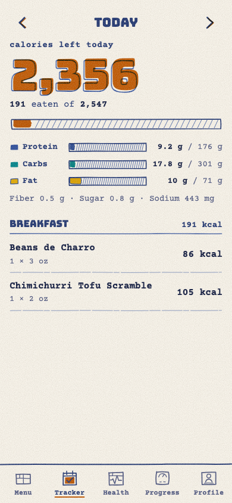

# Longhorn Macros

A phone-first food log for UT Austin dining halls. Pick what you ate at J2, JCL or Kins, and see
the calories and macros you have left today.

**Live:** https://longhorn-macros.vercel.app (install it: Safari → Share → Add to Home Screen)



## What it does

- **Today's real menu.** Every item served at J2, JCL and Kins, by station, for the next seven
  days, with UT's own calories, protein, carbs, fat, fiber, sugar and sodium. Nothing is typed in
  by hand.
- **Log in seconds.** Tap a food, set servings, pick a meal. Search covers this week's menus,
  everything you have logged before, and your own custom foods.
- **Targets that fit you.** Cut, maintain or bulk at a pace you choose. The app estimates your
  maintenance calories from the Mifflin-St Jeor formula, then corrects that estimate from your own
  weight trend as data accumulates, and shows its reasoning before changing anything.
- **Works with no signal.** Dining halls eat phone reception. The log is written on the device
  first and synced afterwards, so adding food never fails.
- **Yours only.** Row-level security in Postgres scopes every row to your account.

## How it's built

Static Preact + TypeScript PWA on Vercel; Supabase Postgres for sync; IndexedDB and an outbox for
offline writes. No server of its own.

The menu comes from UT Housing and Dining's public FoodPro feed
(`hf-foodpro.austin.utexas.edu/foodpro/data_all_endpoint.php?menu=1`), which is CORS-open, so the
phone reads it directly. Hours come from the sibling `?hours=1` endpoint. This project is not
affiliated with or endorsed by the University of Texas at Austin, and nutrition data is UT's:
where UT publishes a blank or implausible value, the app says so rather than inventing one.

The look is a two-ink risograph print: federal blue and burnt orange, overprinted and slightly out
of register, on paper stock, with every icon and doodle drawn by hand as SVG. See
[DESIGN.md](DESIGN.md) for the system and [PRODUCT.md](PRODUCT.md) for who it is for.

## Running it yourself

Requires Node 22+, Docker (for a local Supabase), and the Supabase CLI.

```bash
npm install
make db-env          # starts local Supabase, writes .env.test
make dev             # vite dev server
make check           # eslint + tsc + vitest with 100% coverage on non-UI code
make e2e             # Playwright suite against the local stack
```

To point it at your own Supabase project: apply `supabase/migrations/` to it, then set
`VITE_SUPABASE_URL` and `VITE_SUPABASE_ANON_KEY` (the publishable key, never the secret one).

## Repo map

| Path | What lives there |
|---|---|
| `src/menu/` | Parsing UT's menu and hours feeds, caching, search |
| `src/sync/` | IndexedDB store, outbox, push/pull engine |
| `src/goals.ts`, `src/adaptive.ts` | Targets, and the weight-trend correction |
| `src/ui/` | Screens, hand-drawn icon components, styles |
| `supabase/migrations/` | Schema and row-level security |
| `docs/superpowers/` | The design spec and implementation plan this was built from |

## License

MIT. Not affiliated with the University of Texas at Austin; "Longhorn" refers to the school's
mascot only as a nod, and UT's marks belong to UT.
